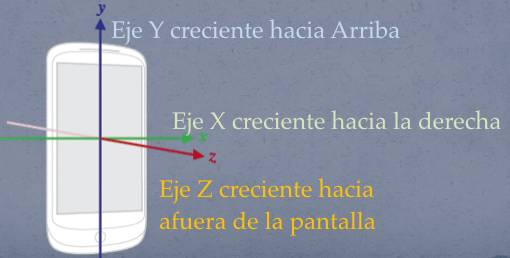

# Android - Resumen de teoría

[TOC]

## Introducción

Android es un sistema operativo móvil construido y comercializado por Google en base a un Kernel Linux. El lenguaje de programación utilizado para desarrollar aplicaciones para Android es Java. Por lo tanto, el primer requisito para poder desarrollar en Android es el **JDK** (Java Development Kit). 

## Requisitos

Los elementos necesarios para desarrollar aplicaciones Android son los siguientes:

* **JDK:** El JDK es el Java Development Kit, es el conjunto de bibliotecas necesarias para desarrollar en el lenguaje Java.
* **SDK Android:** SDK es Software Development Kit, es el conjunto de bibliotecas propias del desarrollo para dispositivos Android.
* **IDE ([Android Studio o Eclipse](#AndroidStudioVSEclipse)):** Si bien no es necesario contar con un IDE (Integrated development environment, o entorno de desarrollo integrado), utilizar uno puede resultar muy útil. Para desarrollar en Android existen dos IDEs principales, Eclipse con ADT Bundle (que ya no recibe soporte por parte de Google), y Android Studio (IDE Oficial).
* **Imagen de una versión Android:** La imagen de una versión Android es necesaria para desarrollar y probar las aplicaciones desarrolladas.

## Aplicaciones

Cada aplicación en Android mantiene su propio proceso y puede tener multiples threads. Cada proceso tiene asignada su propia virtual machine (VM). Cada aplicación es asignada a un único "Linux user ID", y por defecto los archivos de una aplicación son solo visibles por esa aplicación pero pueden explicitamente exportarse a otras aplicaciones. Lo importante a notar aquí es que:

1. Cada aplicación está ejecutandose en un proceso independiente sobre una VM y cuenta con un identificador único.
2. Las aplicaciones no pueden forkear su proceso. No pueden haber subprocesos dentro de una misma aplicación.
3. Las aplicaciones pueden ser multithreading.
4. Cada aplicación mantiene archivos privados que pueden también exportarse.

## Ciclo de vida de aplicaciones Android 


El ciclo de vida de una aplicación en Android es un tema muy bien explicado por Google en su [documentación](https://developer.android.com/training/basics/activity-lifecycle/index.html). Lo que quiere decir este diagrama es que una aplicación en Android es manejada por una máquina de estados con funciones que se ejecutan en cada transición de estados. 

Cada estado está representado por una burbuja (Created, Started, Resumed, Paused y Stopped) y cada transición entre estados está representada por una flecha entre las burbujas (```onCreate()```, ```onStart()```, ```onResume()```, ```onRestart()```, ```onPause()```, ```onStop()``` y ```onDestroy()```)

Los estados pueden ser de **transición** o **permanentes**. Un estado se considera de transición si sirve de pasaje entre un estado y otro, y se considera permanente si la aplicación puede permanecer un tiempo prolongado en ese estado.
El diagrama se puede leer como una *pirámide de pasos*, donde los pasos para subir en la pirámide acercan más a la aplicación a un estado de ejecución en primer plano, y los pasos hacia abajo en la pirmide acercan a la aplicación a un estado fuera de memoria.

Así como una aplicación tiene una serie de estados y transiciones, el mismo ciclo de vida lo implementan las [Activities](#Activities), y es a través de estas que se explica el ciclo de vida de una aplicación.

Entrando en detalle sobre estos conceptos, los estados del ciclo de vida de las activities en Android son los siguientes:

* **Created:** Es un estado de **transición**, y es el primer estado por el que pasa una activity al ser iniciada. En este estado se ejecutan acciones de inicialización, entre ellas, *inflar* la interfaz de usuario.
* **Started:** Es un estado de **transición**, y es el estado siguiente a Created. Se llega a este estado al ser iniciada luego de onCreate() o al haber estado detenida y haber vuelto a ser mostrada al usuario después de onRestart().
* **Resumed:** Es un estado **permanente**, en el cual la activity es mostrada al usuario en primer plano y el usuario puede interactuar con ella.
* **Paused:**  Es un estado **permanente**, en el cual la activity es mostrada parcialmente en pantalla. Una activity pausada no recibe input del usuario y no puede ejecutar ningún código.
* **Stopped:** Es un estado **permanente**, en el cual la activity está completamente oculta y no puede ser vista por el usuario. Cuando una activity está en estado stopped, se considera que está en **background**.

Las distintas transiciones entre estados en una activity pueden ser *escuchadas* y se puede ejecutar código siempre que ocurra alguna de ellas. Dependiendo de la complejidad de una aplicación, puede no ser necesario sobreescribir todas las transiciones entre estados.

Las ventajas de implementar código propio al ejecutarse las transiciones de estados incluyen:

* La aplicación no va a *crashear* al interrumpirse por una llamada telefónica u otras interrupciones similares.
* Se pueden liberar recursos no utilizados.
* Se puede guardar el progreso del usuario para que la aplicación vuelva a estar activa en el mismo estado en que estaba antes de ser interrumpida.
* La aplicación no va a *crashear* al rotarse el dispositivo.

## Componentes esenciales de una aplicación

### <a name="#Activities"></a> Activities

Una activity representa una "pantalla" dentro de la aplicación, incluyendo la representación de la interfaz de usuario y la interacción con el usuario. Cada activity comparte el ciclo de vida de la aplicación y puede reaccionar ante transiciones entre los mismos.

Dentro de una aplicación pueden existir más de un activity y pueden establecerse transiciones entre ellas para lograr una experiencia de usuario más rica.

Cada aplicación puede tener más de un activity, pero necesita que al menos exista una, por la cual la aplicación va a iniciar, y que es llamada **main activity**.

Cada Activity se implementa como una subclase de la clase base "Activity".

Como una Activity es una representación de una pantalla dentro de la aplicación, necesita mostrarse al usuario de algún modo. Para esto, cada Activity posee una vista principal.

Un ejemplo de una activity es el siguiente:

```java
// En este caso nuestra activity se llama ExampleActivity,
// y es importante notar que extiende de la clase base "Activity".
public class ExampleActivity extends Activity {
	
    // Dentro de la vista de un activity podemos contener otras vistas,
    // como por ejemplo un TextView.
    TextView mTextView; 
    
    // En este ejemplo se sobreescribe el método onCreate,
    // lo que nos permite escuchar la transición de estados
    // que ocurre al crearse la activity.
    // Podemos utilizar este metodo para inicializar 
    // la activity.
    @Override
    public void onCreate(Bundle savedInstanceState) {
    	super.onCreate(savedInstanceState);
        
        // Como dijimos, cada activity tiene una "ventana"
        // o vista que la representa visualmente.
        // Con el método setContentView podemos "inflar"
        // esta vista, para que tome el tamaño de la pantalla
        // del dispositivo y se dibuje en pantalla.
        setContentView(R.layout.main_activity);
        
        // Utilizamos también este método para inicializar
        // las vistas que contenga el activity
        mTextView = (TextView) findViewById(R.id.text_message);

    }
    
}
```

### Services

Los services son componentes que no tienen representación visual y se utilizan para realizar tareas en background.
Dentro de una aplicación podríamos vincularnos con un servicio existente y controlar su eejcución.

### Broadcast Receivers

Los BroadcastReceivers reciben y reaccionan a "broadcast announcements". La utilidad de los BroadcastReceivers es que permiten escuchar eventos del sistema. Por ejemplo, batería baja, etc.
Al mismo tiempo, desde una aplicación también podemos crear broadcast announcements para que sean escuchados por otras aplicaciones.

### Content Providers

Los ContentProviders permiten el intercambio de información entre aplicaciones.

Como en android no existe memoria compartida, pipes, etc., los ContentProviders son una solución para el intercambio de información entre distintas aplicaciones por medio de una interfaz común estándar.

La comunicación por medio de Content Providers consta de dos partes:

* Un ContentProvider muestra información pública que puede ser accedida desde otra aplicación.
* Un ContentResolver se utiliza desde otra aplicación para acceder a la información publicada por el ContentProvider de la primera aplicación.

### Intents

Un Intent es un objeto utilizado para enviar mensajes entre componentes Android, con el objetivo de requerir que se ejecuten acciones.

Existen tres casos de uso principales para un intent:

1. **Iniciar una activity.** Una activity representa una pantalla en una aplicación. Se puede iniciar una activity enviando un Intent al método ```startActivity()```

2. **Iniciar un servicio.** Un servicio es un componente que ejecuta operaciones sin una interfaz de usuario. Se puede iniciar un servicio para efectuar una operación que se ejecute una única vez (como descargar un archivo) enviando un Intent al método ```startService()```

3. **Enviar un mensaje broadcast.** Un broadcast es un mensaje que cualquier aplicación puede recibir. El sistema broadcasts variados notificar sobre eventos del sistema, como puede ser el inicio del sistema o que el dispositivo comienza a cargar su batería. Se pueden enviar un broadcast a otras aplicaciones pasando un Intent a los métodos ```sendBroadcast()```, ```sendOrderedBroadcast()``` o ``` sendStickyBroadcast()```.

Los intents pueden ser de dos tipos:

1. **Explícitos.** Un intent explícito especifican los componentes por su nombre completo. Se utilizan para iniciar un componente en la misma aplicación donde se crea el intent, porque se conoce el nombre de la clase del componente que se quiere iniciar.

2. **Implícitos.** Un intent implícito no nombra un componente específico sino que en cambio declaran una acción general a realizar, lo que permite a un componente de otra aplicación, manejarlo.

### Android manifest

El AndroidManifest es un archivo XML de configuración, cuyo objetivo principal es declarar los componentes al sistema Android.

Dentro de un AndroidManifest pueden incluirse también los permisos para utilizar la cámara, acceder a los contactos del dispositivo, etc.

```xml
<?xml version="1.0" encoding="utf-8"?>
<manifest . . . >
    <application . . . >
        <activity 	android:name="com.example.project.FreneticActivity"
                  android:icon="@drawable/small_pic.png"
                  android:label="@string/freneticLabel" 
                  . . .  >
        </activity>
        . . .
    </application>
</manifest>
```

Dentro del manifest se pueden declarar las acciones que van a manejar los intents implícitos. Es necesario declarar cuáles van a ser los intents implícitos que se van a recibir.

Para cada intent implícito se debe utilizar una etiqueta ```<intent-filter>```, que indica cuales son los intents implícitos que la aplicación permite recibir.

Por ejemplo:

```xml
<activity android:name="ShareActivity">
    <intent-filter>
        <action android:name="android.intent.action.SEND"/>
        <category android:name="android.intent.category.DEFAULT"/>
        <data android:mimeType="text/plain"/>
    </intent-filter>
</activity>
```

### Vistas

**LAS VISTAS NO APARECEN EN LA PPT COMO UN COMPONENTE ESENCIAL**

Para representar interfaces gráficas en Android se utilizan las clases **View** y **ViewGroup**.

Una **View** representa cualquier componente gráfico individual. Ejemplos de Views son botones, textos, imágenes, etc.

Un **ViewGroup** es un contenedor de vistas que permite disponerlas en pantalla en un orden y posición determinados. Ejemplos de ViewGroups son:
* LinearLayout: organiza sus sub-vistas en forma lineal una debajo de la otra o una al lado de la otra en el orden en que fueron definidas.
* RelativeLayout: organiza sus sub-vistas de manera relativa una con otra. Por ejemplo, podríamos definir un TextView que se dibuje debajo de otro TextView y un Button que se dibuje en el medio del Layout.

## Introducción a sensores

Los dispositivos Android tienen sensores que permiten obtener información del ambiente en tiempo real y con alta precisión.

Si clasificamos a los sensores por su funcionalidad, podemos dividirlos en:

* **Sensores de movimiento:** Miden cambios en la velocidad del dispositivo.
* **Sensores de medio ambiente:** Miden cambios en la temperatura del interior del dispositivo.
* **Sensores de posición:** Utilizan el sensor de campo geomagnético, el giroscopio y el acelerómetro, para crear una brújula (la API de Android ya contempla esta funcionalidad).

Es importante notar que no todos los sensores están disponibles en todos los dispositivos.

## Sistemas de coordenadas en sensores



En general, el framework de los sensores, utiliza un sistema de coordenadas estándar, de 3 ejes, para expresar los valores capturados. 

Para la mayoría de los dispositivos, el sistema de coordenadas, es definido relativo a la posición de la pantalla cuando el dispositivo es sostenido en la posición por defecto 

## Escuchando sensores

Para recibir notificaciones de eventos ocurridos, se debe implementar la interfaz ```SensorEventListener```.

La interfaz SensorEventListener define dos métodos que deben ser implementados. 

Para detectar cambios de precisión en un sensor en tiempo real, se debe implementar el método ```onAccuracyChanged()```, que recibe dos parámetros:

1. Referencia al sensor
2. Nuevo valor para el cambio de precisión

Para recibir un nuevo valor medido por el sensor, se debe implementar ```onSensorChanged()```, que recibe los siguientes parametros:

1. Precisión de la medición
2. Sensor que detectó el cambio
3. Marca de tiempo del evento
4. Datos de la medición.

## <a name="#AndroidStudioVSEclipse"></a>Android Studio vs eclipse