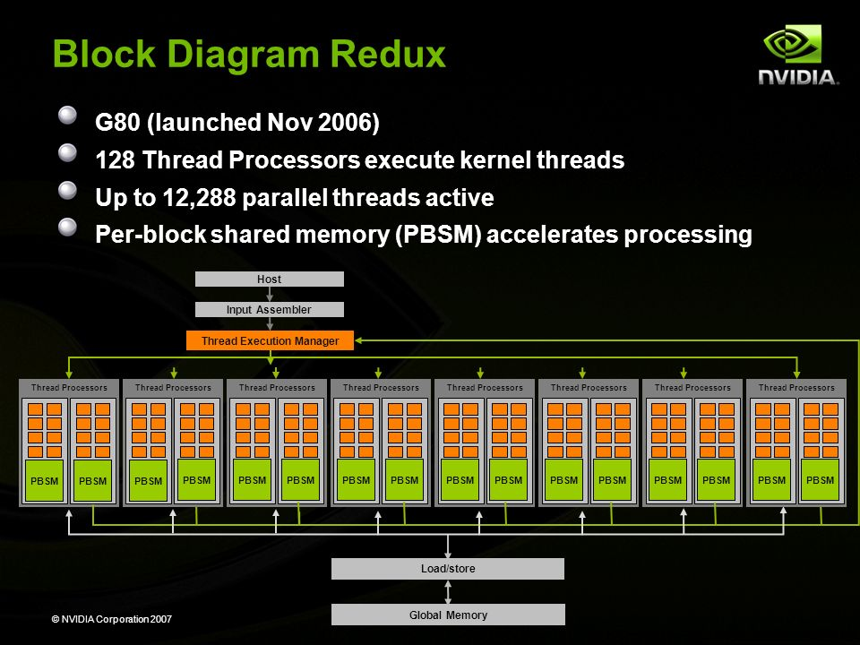

# GPU (Apuntes tomados en clase - preliminar)

* [Introduccion.](#Introduccion)
* [CPU vs GPU.](#CPU-vs-GPU)
* [GPGPU.](#GPGPU)
* [Historia de las GPU.](#Historia)
    * [Arquitecturas G80.](#Arquitecturas-G80)
    * [Arquitecturas GT200.](#Arquitecturas-GT200)
    * [Arquitecturas FERMI.](#Arquitecturas-FERMI)
* [División de memoria en GPU.](#Division-de-memoria)
    * [Memoria global.](#Memoria-global)
    * [Memoria de registros.](#Memoria-de-registros)
    * [Memoria local.](#Memoria-local)
    * [Memoria compartida.](#Memoria-compartida)
    * [Memoria de texturas.](#Memoria-de-texturas)
* [Programación multidimensional.](#Programacion-multidimensional)
    * [Flujo de datos.](#Flujo-de-datos)
    * [Dimensiones.](#Dimensiones)
* [Ejercicios.](#Ejercicios)
* [No todo lo que brilla es oro (Probleas con la GPU.)](#Problemas)

## Introducción

GPU es Graphics Processor Unit. Es decir, unidad de procesamiento de gráficos. Se trata de un componente masivamente paralelo para ejecución de tareas muy demandantes de procesamiento, específicamente para aplicaciones gráficas.
La GPU se considera una arquitectura configurable debido a que en tiempo de ejecución se adapta y se configura a lo que se requiere que haga.
Algo muy importante al hablar de GPU es el concepto de **pipeline**. Pipeline es una serie de pasos sobre la geometría y datos de entrada.
La GPU fue tradicionalmente un dispositivo utilizado para aplicaciones gráficas. Sin embargo, al brindar una gran potencia de cálculo, se comenzó a utilizar para aplicaciones de uso general, dando lugar al concepto de GPGPU (General programming graphics processor unit).
Para realizar programación de GPGPU se desarrollaron conjuntos de bibliotecas y herraminentas. 
Una de las herramientas notables que se han desarrollado con este propósito es **CUDA**, desarrollado por NVidia.
Por otra parte, **OpenCL** se desarrolla como contrapartida de NVidia pero open source, y permitiendo la programación tanto para la CPU como para la GPU.

## CPU vs GPU

|CPU | GPU|
|---|---|
|Pensada para acelerar un conjunto de aplicaciones(varias)| Pensada para mejorar el desempeño de una única aplicación con alta demanda de procesamiento paralelizable.
|Varios núcleos complejos e independientes|Vector de núcleos muy numerosos y muy simples|

## GPGPU

Inicialmente, se desarrollaban aplicaciones para la GPU utilizando el lenguaje [_shaders_](https://es.wikipedia.org/wiki/Shader) y solamente utilizando el pipeline gráfico.
La GPU tiene una gran capacidad de cálculo al estar preparada para lanzar miles de hilos en paralelo.
Actualmente se pueden utilizar lenguajes de propósito general para aplicaciones de propósito general utilizando la GPU.
A nivel de hardware, se han reemplazado procesadores dedicados para píxeles y texturas por procesadores de propósito general.
La GPU utiliza el modelo de ejecución SIMT (simple instruction, multiple threads). Se lanzan muchos hilos para ejecutar la misma instrucción sobre un conjunto de datos.
Como se ha dicho, ya no se utiliza unicamente el lenguaje Shaders, sino que se pueden utilizar lenguajes de propósito general, como C, con herramientas como CUDA o OpenCL.
Se introdujo memoria compartida y comunicación por barreras.

## Historia de las GPU

### Arquitecturas G80

Incluyen 8 módulos de procesamiento paralelo que se llaman **TPC** y forman un **cluster** ya que todos ellos trabajan en conjunto. Los TPC son transparentes para el desarrollador y su manejo depende exclusivamente de la GPU.
Los TPC contienen dos unidades cada uno llamadas SM (streaming units), que tienen memorias compartidas. 
También contienen SP (Stream processors) que son la mínima unidad de la GPU que ejecuta instruccciones.

### Arquitectura GT200 (SM+1 por TPC)

Cada TPC tiene 3 SMs (Basicamente, tienen más procesadores). Los TPCs forman un cluster al igual que en el modelo anterior (G80) porque trabajan en conjunto
Además de estas mejoras de hardware se introduce un nuevo concepto llamado **acceso coalesced**: Cada paquete de hilos que se ejecuta se llama **guard**. El acceso coalescen trae información para los hilos como paquetes de información consecutivas. No se trae un dato para cada hilo, sino que se trae un paquete de posiciones de memoria consecutivas de la cual se abastecen todos los hilos del guard.

### Arquitecturas FERMI

Se agrega una SM más (ahora son 4 SM por TPC), con 64 bits, lo que permite trabajar con punto flotante de doble precisión.
**GIGA Thread engine + warp:** La ejecución de **Kernel** es en paralelo. 
(Se considera Kernel en GPU al algoritmo que se va a ejecutar, y a la forma de organizar los hilos dentro del Kernel.)
La arquitectura FERMI logra (teóricamente) casi 200.000 hilos de ejecución en paralelo.

## División de memoria en GPU

Hay dos tipos de memorias en GPU:

1. **Interna**: Es rápida pero escasa
2. **Externa**: Es lenta y amplia.

Esta diferencia de velocidades en los accesos a las memorias se debe a que las memorias externas son compartidas entre distintos componentes, de modo que el acceso a ellas consta de más pasos, además de que se encuentra más alejada físicamente.

Para compartir información entre los hilos se debe utilizar una memoria global, lo que implica una tardanza.

### Memoria global

* Unica a la que se puede acceder desde la CPU
* La CPU carga los datos a procesar y luego obtiene los resultados
* Cada thread obtiene inicialmente los datos de esta memoria
* se encuentra en memoria on-board (Tarda más)
* Es amplia

### Memoria de registros

* Es más rápida (Esta dentro de cada SP)
* Es accedida privadamente por cada thread.
* Es muy chica, y se debe optimizar por ese mismo motivo.

### Memoria local

* Es memoria externa
* Es privada para cada hilo
* Aquí se depositan los datos iniciales.

### Memoria compartida

* Puede ser accedida por todos los threads dentro de un mismo bloque
* Es una caché
* Se utiliza para compartir los datos entre threads del mismo bloque
* No sirve si los threads pertenecen a distintos bloques
* Alta velocidad de acceso.

### Memoria de texturas

* A diferencia de la memoria global, esta tiene un caché, para acceso optimizado.
* Está al mismo nivel que la memoria global.

## Programación multidimensional

Se busca organizar los procesadores de la mejor manera según lo que se busca realizar.

### Flujo de datos

1. Desde la CPU se envían los datos a analizar al GPU
2. El CPU conoce el algoritmo a ejecutar, así que eso hay que pasarlo a la GPU, para que aplique sobre los dats enviados en el paso [1]. Aquí se organiza multidimensionalmente la GPU, PARA CADA JUEGO DE DATOS. El algoritmo a ejecutar se llama **KERNEL**
3. Los resultados se pasan de la GPU a la CPU.

### Dimensiones

Existen tres estructuras lógicas:

1. **Hilo:** Es la mínima unidad lógica de ejecución.
2. **Bloque:** Es un conjunto de hilos organizados de una forma determinada.
3. **Grilla:** Es un conjunto de bloques organizados de una forma determinada.

La jerarquía entonces queda:

**Hilo - Bloque - Grilla**

Grilla contiene bloques - Bloque contiene hilos.

La GPU no maneja a los hilos en forma independiente, sino como conjuntos de bloques de hilos.

Los bloques definen cómo se organizan sus hilos internamente. Esta organización puede ser:

* **Bloques-thread (1D):** Cada hilo tiene un identificador, y el bloque organiza los hilos en forma de array unidimensional.
* **Bloques-thread (2D):** El bloque organiza sus hilos en forma de matriz. En este caso, cada hilo se accede directamente con el identificador, y no hace falta recorrer toda la matriz hasta encontrar el hilo buscado.
* **Bloques-thread (3D):** El bloque organiza sus hilos en forma de cubo tridimensional. El identificador en este caso tiene tres posiciones.

Así como los bloques pueden organizar a sus hilos en una, dos o tres dimensiones, las grillas pueden organizar a sus bloques en una, dos o tres dimensiones.

## Ejercicios

// TERMINAR ESTO

## No todo lo que brilla es oro (Problemas con la GPU)

* Latencia de transferencia a memoria
* Dependencia de la CPU. La CPU es un cuello de botella para la velocidad de la GPU, de modo que la GPU termina esperando a que la CPU le envie instrucciones y operandos desperdiciando tiempo.
* Warp/Wavefront y condiciones.
	* Hay que evitar lo mayor posible las decisiones en un kernel.
	* Para evitarlo, se pueden armar dos hilos distintos, unos para la parte verdadera y otros para la parte falsa.
* Profiler GPU.	
	* Se puede inspeccionar la actividad interna del GPU.